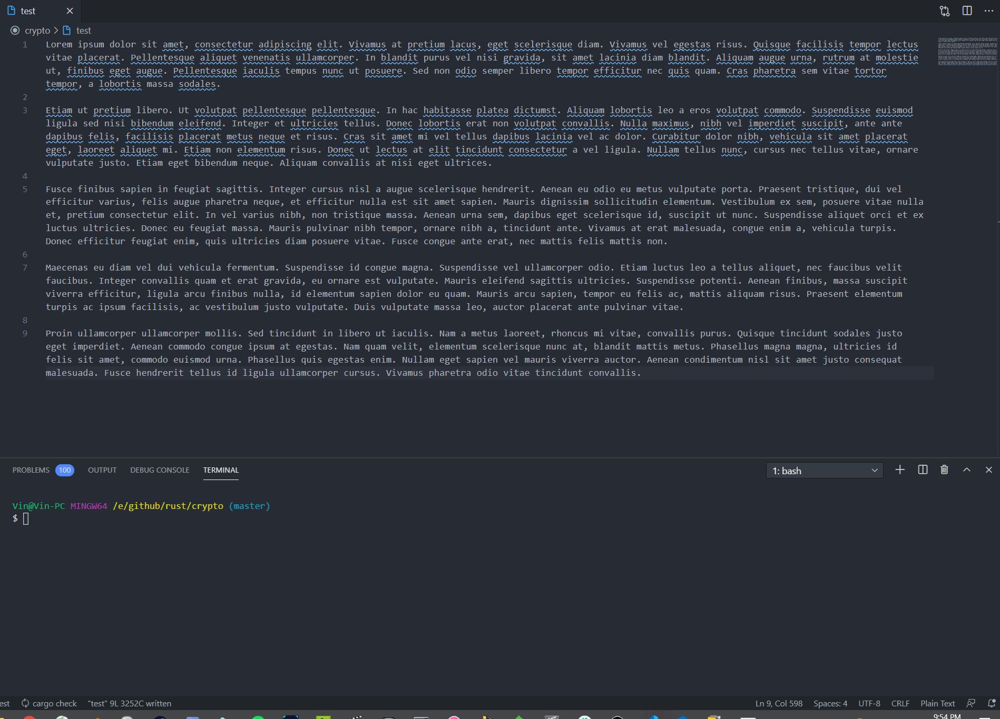

# rustencrypter-cli
An encryption cli tool for directories and files written purely in Rust. Uses AES-GCM with 128 bit encryption. 



## Installation
```bash
git clone https://github.com/Ayuei/rustencrypter.git
cargo install --path rustencrypter
```

## Usage
```
./rustencrypter <input file> <--[e]ncrypt|--[d]ecrypt> --[k]ey <key file>
```
**Note encryption and decryption will overwrite the source file, this will be altered in future with a flag**

*You can only do a single encrypt or decrypt operation per call*


## Features
- [x] Encrypt a file
- [x] Encrypt all files in a given directory
- [x] Automatic key generation (creates "key" in calling/working directory) or requested directory/file
- [x] User can specify specific key file (16 bit)
- [x] Fresh nonce every encryption
- [x] Encryption/decryption chaining

## Neat things
You can chain multiple encryptions and decryptions symmetrically for added security.
```
./rustencrypter file -e
./rustencrypter file -e
./rustencrypter file -d
./rustencrypter file -d
```

## TODOs
- [ ] Release compiled binaries for all platforms
- [ ] Add an optional flag for an output file
- [x] Add authentication for tamper detection (HMAC)
- [ ] Add support for embedded encryption and decryption chaining
- [x] Refactor for speed using callbacks
- [x] Fix some race conditions in the test cases
- [ ] Multi-threads or Async for directory encryption/decryption
- [ ] Add python bindings (personal project)

Feel to do any pull requests or let me know about any issues. 
